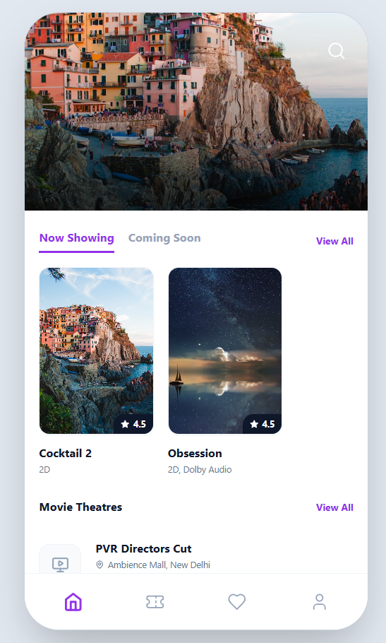
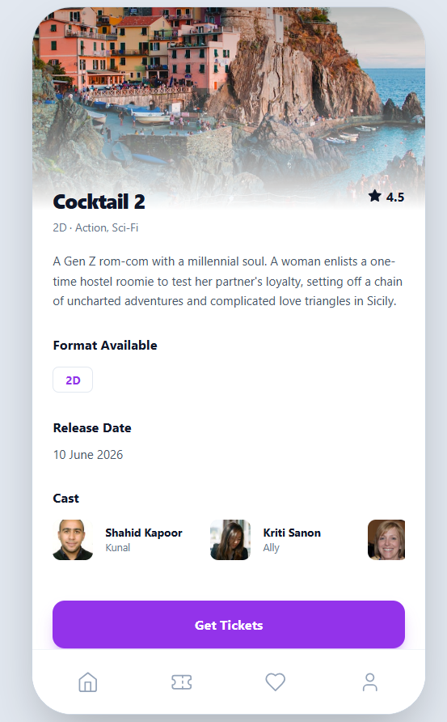
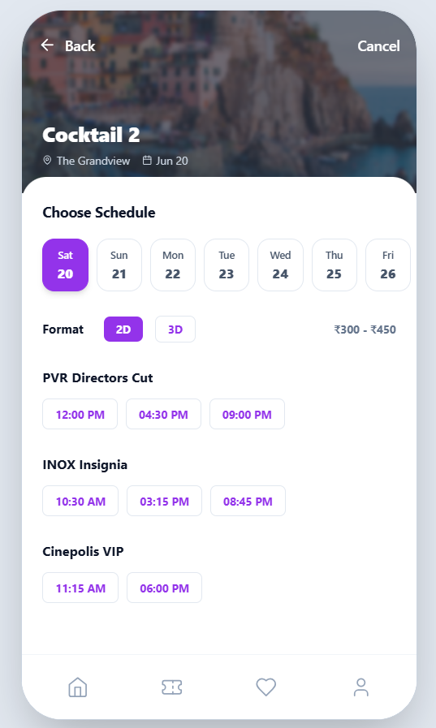
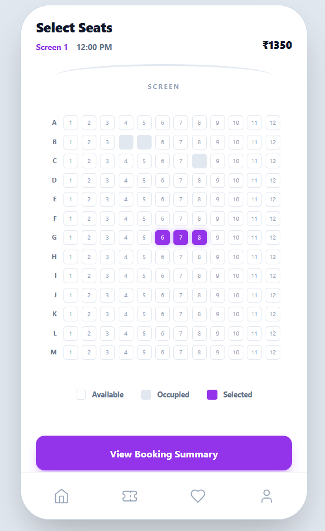
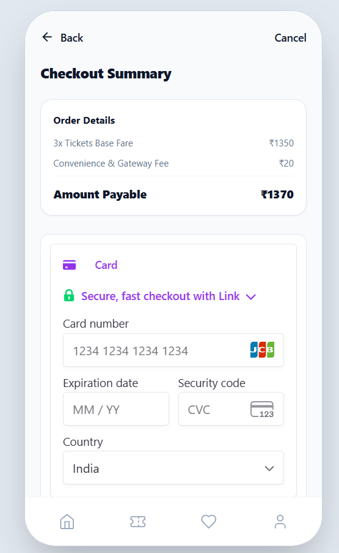
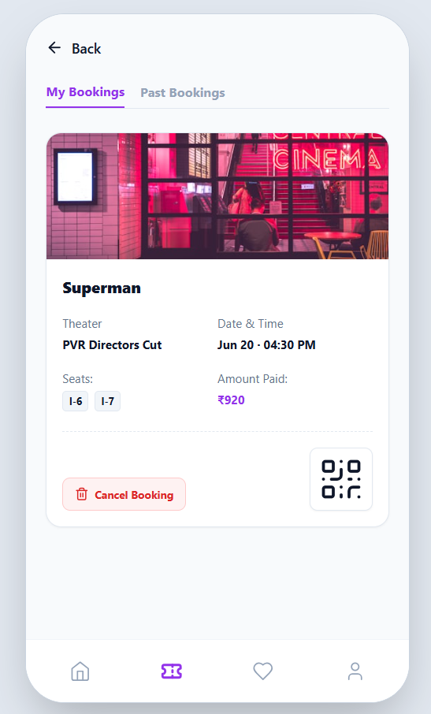
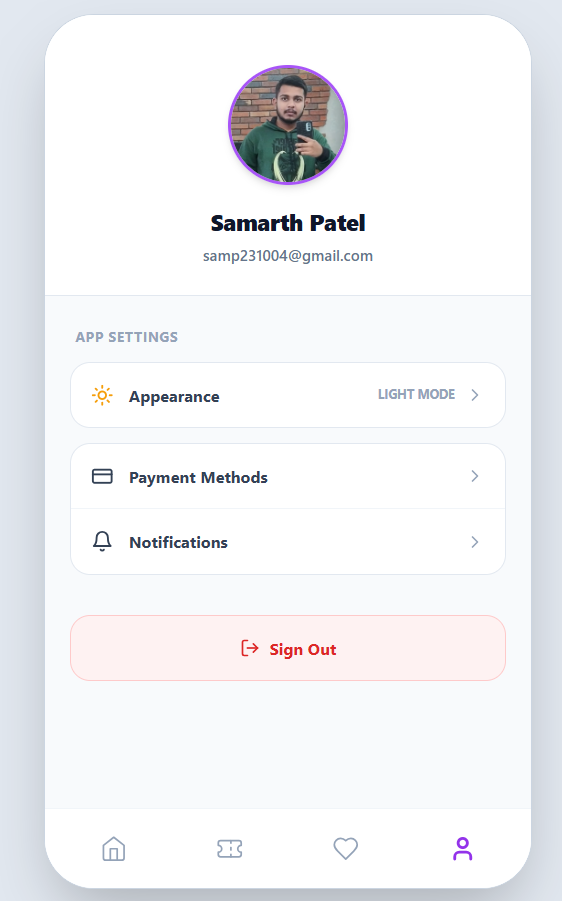

# 🎬 CineReserve - Movie Ticket Reservation Platform

[](https://reactjs.org/)
[](https://nodejs.org/)
[](https://expressjs.com/)
[](https://www.mongodb.com/)
[](https://tailwindcss.com/)
[](https://redis.io/)
[](https://stripe.com/)

A minimalist, high-performance mobile-first web application built for the **Creative Upaay Full Stack Development Assignment**. CineReserve replicates a premium movie ticket booking journey with real-time seat locking, secure payment processing, and strict architectural constraints.

---

## 📸 Application Gallery

<div align="center" style="display: flex; gap: 15px; overflow-x: auto; padding: 10px; border-radius: 8px; background: #0f172a;">
  
  
  
  
  
  
  
</div>

---

## 🚀 Features & Assignment Fulfillment

This project successfully fulfills **100% of Level 1 functionalities** and **all Level 2 Advanced functionalities**.

| Status | Feature | Implementation Details |
| :---: | :--- | :--- |
| ✅ | **Strict UI Constraint** | Max-width explicitly capped at `390px` to mirror the Figma mobile-first aesthetic perfectly. |
| ✅ | **Custom Seat Matrix** | Programmatically generated strict grid (Rows A-M, Cols 1-12) with Available, Occupied, and Selected visual states. |
| ✅ | **Dynamic Calculation** | Live updating cart totals with a strict cap of **6 tickets maximum** per transaction. |
| ✅ | **State Persistence** | Redux Toolkit synchronized tightly with `localStorage` to survive hard page refreshes mid-booking. |
| ✅ | **My Bookings & QR** | Ticket management dashboard featuring mock QR generation and complete booking cancellation functionalities. |
| 🌟 | **Clerk Authentication** | Level 2: Protected routes requiring user login/signup before allowing access to the checkout/payment gateway. |
| 🌟 | **Stripe Payments** | Level 2: Replaced mock gateway with a PCI-compliant, fully functioning Stripe Elements implementation. |
| 🌟 | **Redis Distributed Locking** | Level 2: Prevents race conditions. Seats selected by User A are "locked" via Upstash Redis for 5 minutes during checkout. |
| 🌟 | **ACID Transactions** | Level 2: Uses `mongoose.startSession()` and `commitTransaction()` ensuring payments and database seat allocations never desync. |
| 🌟 | **Bonus: Light/Dark Mode** | Full Tailwind custom theme integration persisting via Redux. |

---

## 🧠 Core Logic & Architecture

### 1. State Management & Persistence
Global state is managed via **Redux Toolkit**. Because a booking journey spans across 5 isolated screens (Home -> Details -> Schedule -> Seats -> Checkout), Redux passes the complex reservation object smoothly. A custom `store.subscribe` listener intercepts state changes and serializes them to `localStorage`, ensuring zero data loss if the browser refreshes.

### 2. Concurrency Control (Distributed Locking)
To prevent double-booking, the app uses a **Redis Cache (via Upstash)**. 
* When a user proceeds to checkout, the backend fires `redisClient.setEx(key, 300, userId)`. 
* This temporarily "claims" the seat for exactly 5 minutes (300 seconds). 
* If another user clicks the same seat, Redis rejects it with an HTTP `409 Conflict`.
* Upon successful Stripe payment, the Redis lock is destroyed and the Mongoose database claims the seat permanently.

---

## ⚙️ Local Development Setup

### Prerequisites
* Node.js (v18+)
* MongoDB Cluster URI
* Redis URI (Free via Upstash)
* Stripe API Keys (Test Mode)
* Clerk Publishable Key

### 1. Backend Configuration
Navigate to the `backend` directory and install dependencies:
```bash
cd backend
npm install

```

Create a `.env` file in the `backend/` directory:

```env
PORT=5000
MONGO_URI=mongodb+srv://<user>:<password>@cluster.mongodb.net/cinereserve
REDIS_URI=rediss://default:<password>@<endpoint>.upstash.io:<port>
STRIPE_SECRET_KEY=sk_test_...

```

Start the backend server:

```bash
npm run dev

```

### 2. Seed the Database

With the backend running, inject the starter movies and theaters into MongoDB by hitting the seed route via a separate terminal:

```bash
curl -X POST http://localhost:5000/api/seed
# Windows PowerShell: Invoke-RestMethod -Uri http://localhost:5000/api/seed -Method POST

```

### 3. Frontend Configuration

Navigate to the `frontend` directory and install dependencies:

```bash
cd frontend
npm install

```

Create a `.env` file in the `frontend/` directory:

```env
VITE_API_URL=http://localhost:5000/api
VITE_STRIPE_PUBLISHABLE_KEY=pk_test_...

```

*(Note: The Clerk Publishable Key is safely hardcoded in `main.jsx` for testing convenience).*

Start the frontend development server:

```bash
npm run dev

```

**Important:** Ensure your browser DevTools (F12) is open and set to a Mobile viewport (`390x844`) for the intended layout experience.

---

## 👨‍💻 About the Author

**Full-Stack Software Developer** with strong experience building scalable SaaS applications and enterprise-grade backend systems using Java, Spring Boot, React.js, Next.js, Node.js, MongoDB, React Native, and AWS. Proven ability to design secure payment systems, implement real-time and AI-powered features, and deliver production-grade web and mobile platforms. Proficient in REST API development, Spring Security, CI/CD pipelines, React Native & Expo mobile development, and cloud-native deployments. Active open-source contributor with multiple merged pull requests across community projects and a track record of delivering high-impact solutions in real-world environments.

* 🌐 **Portfolio:** [samp231004.github.io/Portfolio](https://samp231004.github.io/Portfolio/)
* 🐙 **GitHub:** [github.com/SamP231004](https://github.com/SamP231004)
* 💼 **LinkedIn:** [linkedin.com/in/samp231004](https://www.linkedin.com/in/samp231004/)
* 📄 **Resume:** [View / Download Document](https://drive.google.com/file/d/1Ci5U-3jc_Xhmj7oOVeFsdix1uGfOCAom/view?usp=sharing)